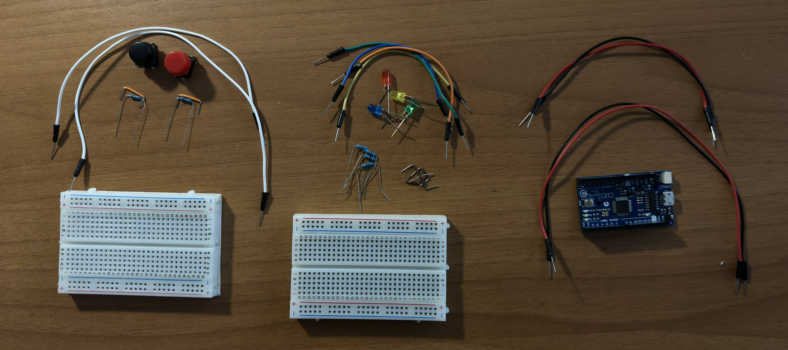
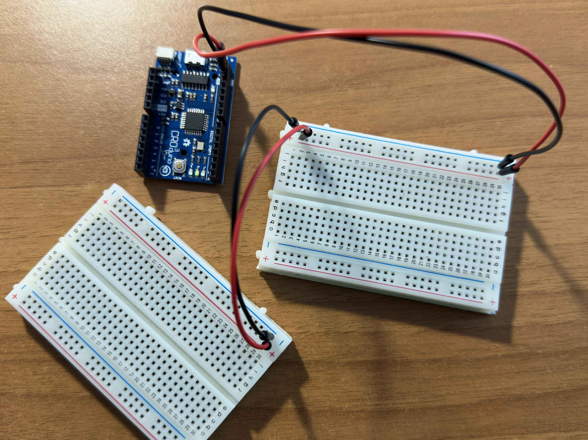
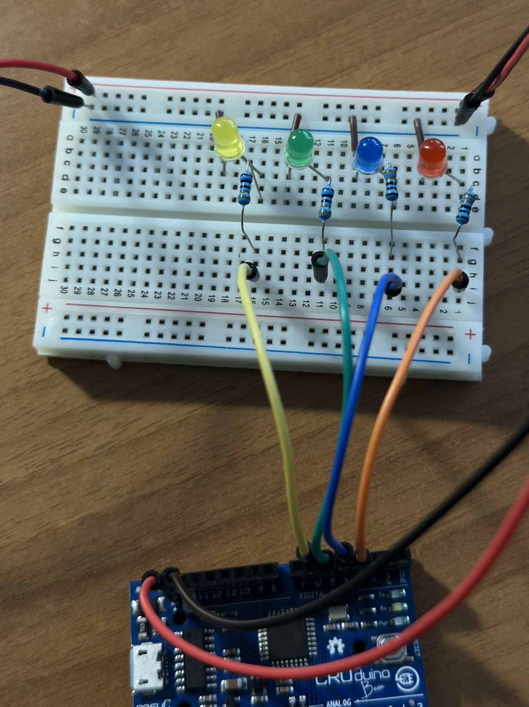
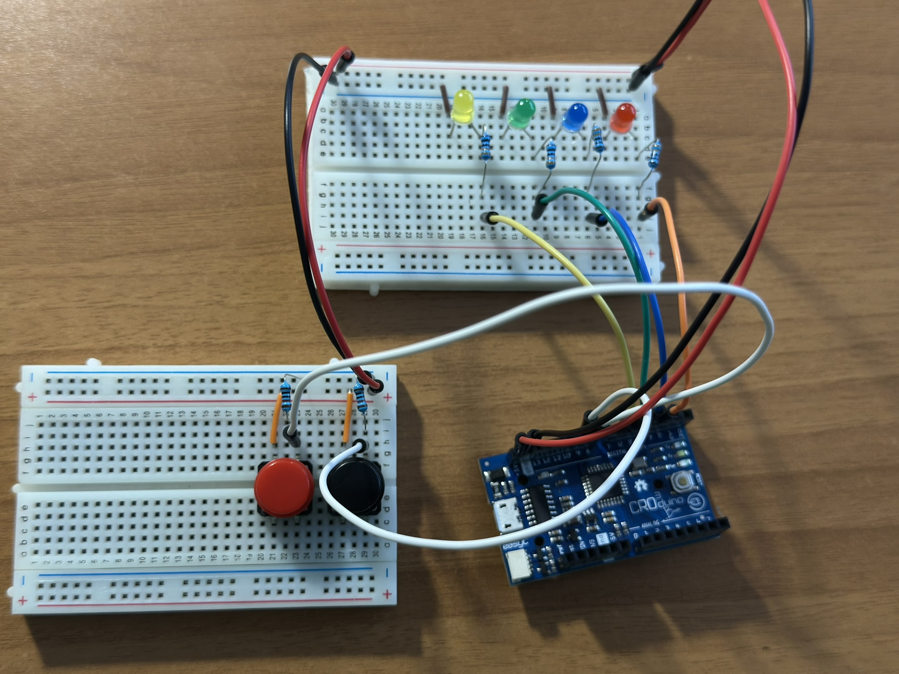

# sizeof() und LEDs

## Beschreibung

Ein Arduino-Projekt, das die Größe von C-Datentypen (`int`, `char`, `bool`, `double`) visuell mit LEDs darstellt. Mithilfe zweier Knöpfe wird ein Zähler erhöht oder verringert — sobald der Wert der Bytegröße eines Typs entspricht, leuchtet die zugehörige LED auf.

---

## Verwendete Hardware

- 4 LED-Dioden (möglicherweise unterschiedlicher Farben)
- 4 330Ω Resistoren
- 2 Knöpfe (möglicherweise unterschiedlicher Farben)
- 2 10kΩ Resistoren
- mindestens 1 Breadboard (leichter mit 2 Breadboards)
- 16 Drähte
- 1 Mikrocontroller (ich benutze Croduino 3 Basic, aber verschiedene Arduino-Mikrocontroller sind möglich)
- 1 Kabel, um den Mikrocontroller mit dem Computer zu verbinden

---

## Anweisungen

1. **Die Versorgungsspannung mit den Breadboards verbinden** (5V und Masse).
   
   

2. **Die LEDs mit dem Mikrocontroller verbinden.**
   
   
   - Kathode (−) → Masse
   - Anode (+) → 330Ω Resistor → Pin auf dem Mikrocontroller

3. **Die Knöpfe mit dem Mikrocontroller verbinden.**
   
   
   - eine Seite: 5V Versorgungsspannung
   - andere Seite: durch einen 10kΩ Resistor mit der Masse verbinden und mit dem Pin auf dem Mikrocontroller

4. **Den Code anpassen und hochladen.**

---

## Wie es funktioniert

`sizeof` ist in C ein Operator, der angibt, wie viele Bytes ein Datentyp oder ein Ausdruck im Speicher belegt. In meinem Fall ergeben sich folgende Werte: `int` = 2, `char` = 1, `bool` = 1 und `double` = 4. Wenn der Zähler einen dieser Werte erreicht, leuchtet die LED, die den entsprechenden Datentyp repräsentiert.
